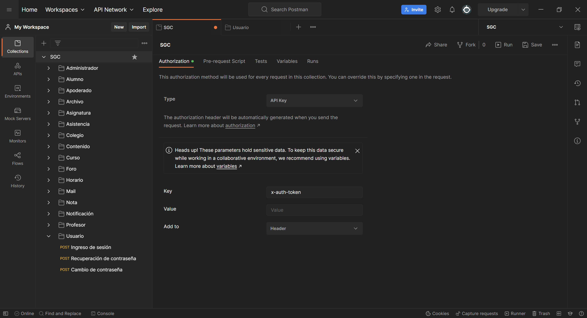

# Sistema de gestión curricular - Backend

## Requisitos previos a la instalación.

Se debe tener instalado Node JS para la ejecución y buildeo del proyecto, en este caso se utilizó la versión 16.16.0

Se debe además crear un archivo .env en la raiz del proyecto. El archivo .env debe contener los siguientes parámetros.

### Puerto del servidor 
- `/PORT: *Puerto donde correrá la aplicación`
### Base de datos
- `DATABASE_URL: *String para la conexión de la base de datos`
### JWT Token
- `SECRET_KEY: *Clave para la creación de Json Access Token`

### Configuración de correo (Mail Gun)
- `MAILGUN_DOMAIN: *Dominio del servicio de correos`
- `MAILGUN_API_KEY: *Llave de acceso para el servicio de correos`

### Configuración de front
 - `FRONT_URL= *Url del sitio web`
##### Sin estas dos variables no se podrá enviar correos.

## Instalación

- Instalar las dependencias del proyecto ingresando el comando `npm run install`

  ### Base de datos

    - Primero, se debe ejecutar el comando `npx prisma migrate dev` para generar las tablas de la base de datos.

    - Segundo, se debe generar el schema de prisma, para eso se utiliza el comando `npx prisma generate`.

    - Tercero, para ingresar un administrador (ya que sin él no se podrá entrar a la aplicación y generar nuevos usuarios) se debe utilizar el comando `npx prisma studio` para generar una interfaz visual de la base de datos e ingresar el administrador correspondiente.

- Luego de haber realizado todo con respecto a la base de datos, se debe ingresar el siguiente comando `npm run start` y se ejecutará la aplicación.

- *Se incluye igualmente la colección del postman, donde contiene todos los Endpoints correspondiente de la aplicación *

## Postman

### Requisitos

- Para la utilización correcta del postman primero se debe generar un token de acceso, es recomendable iniciar sesión a través de la petición y obtener ese token para luego ser ingresada en la carpeta principal de la colección.

- Una vez generado ese token se ingresa a la carpeta principal de la colección y en el apartado de "Authorization", en la casilla Value ingresar el token generado anteriormente.
